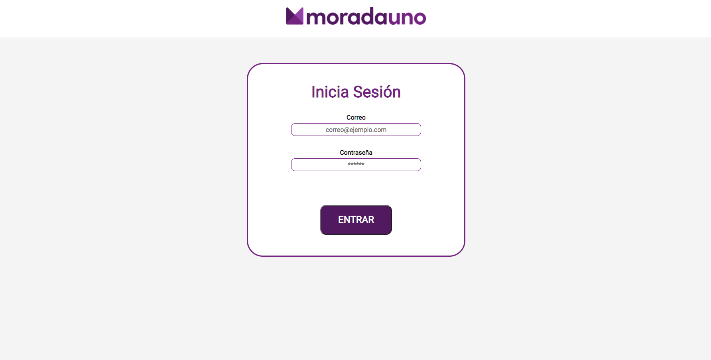
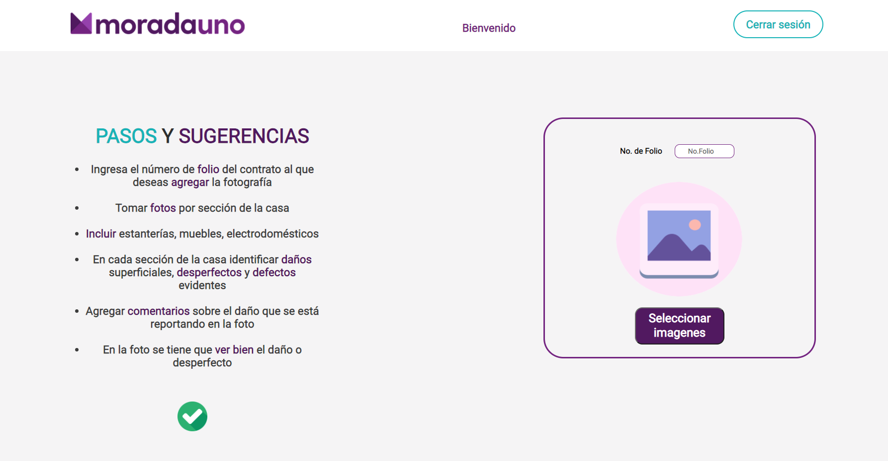
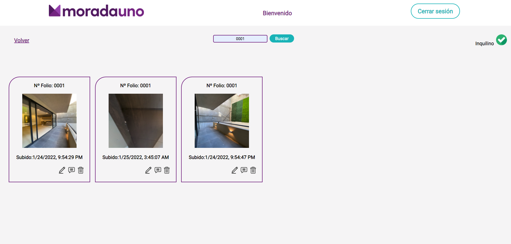
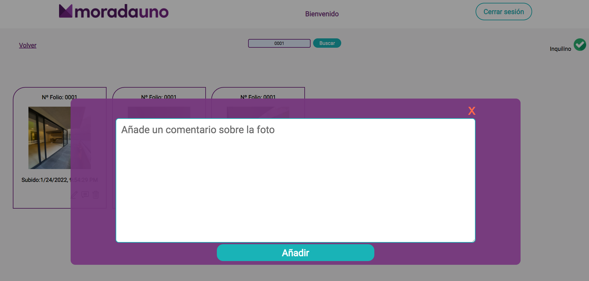
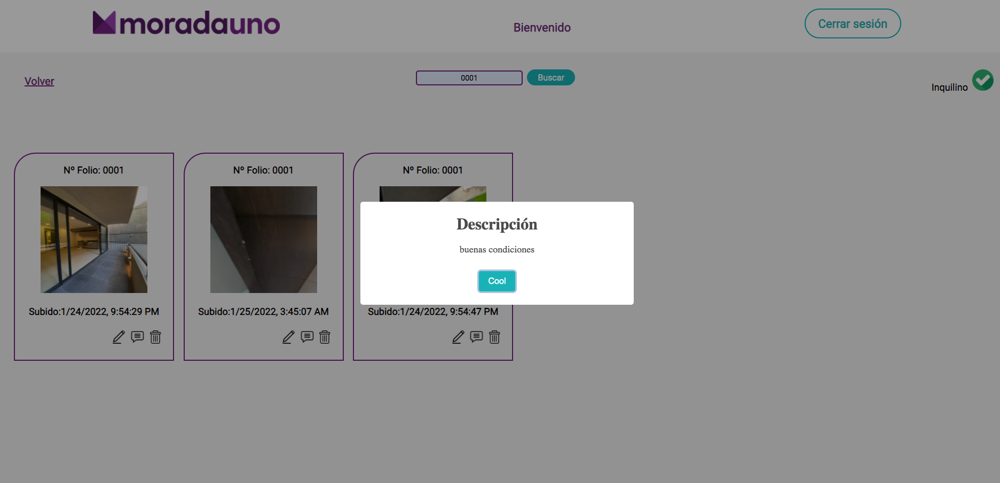
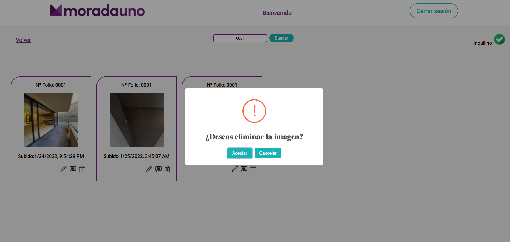

# PROYECTO DE TALENT-FEST 2022 MORADAUNO

## CONTEXTO 
Morada Uno es una empresa que ayuda a propietarios e inquilinos a rentar inmuebles contruyendo tecnología para dar buenas experiencias digitales a sus usuarios. 

## PROBLEMATICA
En este proceso hay una parte que sigue siendo ineficiente: el inventario fotográfico, no hay un control de las fotografias que se toman para informar el estado del inmueble.

## PROPUESTA DE SOLUCIÓN

Crear un inventario digital donde se puedan almacenar las fotografías de los inmuebles y se puedan buscar por numero de contrato para un mejor manejo de la infomación.

## DESCRIPCIÓN DE LA APP

Esta app permite el acceso a asesores e inquilinos para que puedan cargar las fotografías que pertenecen a un numeros de folio especifico de contrato y asi generar un inventario con todas las fotografías de todos los contratos y que se puedan ir filtrando por Nº de folio (del contrato).
Solo asesores e inquilinos podran subir imagenes, agregar comentarios de las mismas y eliminarlas. El inventario es publico y se verá una vez ingresado el folio de contrato del que se desea ver las fotografias.
Cada fotografia se muestra con su numero de folio, fecha y hora en la que se subió.

La app se implemento con ReactJS, utilizando firebase para almacenar la data y SASS para parte del diseño.

## VISUALIZACIÓN

### Inicio de sesión:

### Carga de imágenes:

### Visualización de inventario:

### Añadir descripción:

### Visualizar descripción de imágen:

### Eliminar imágen:

### Link a la app:
https://morada-uno-012022.web.app/down-imgs
 
